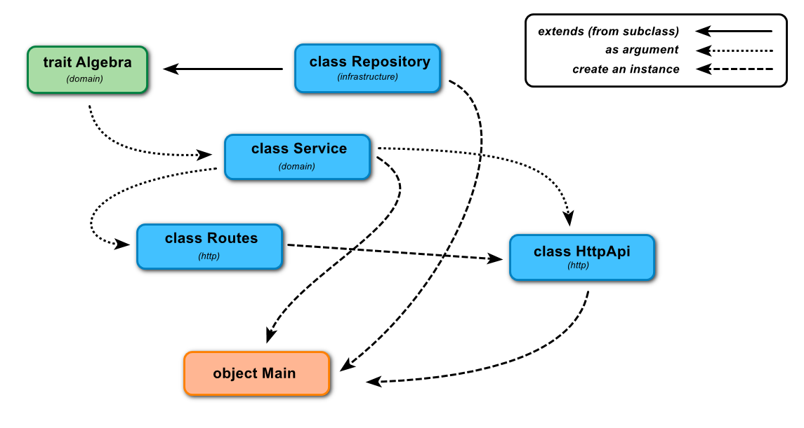
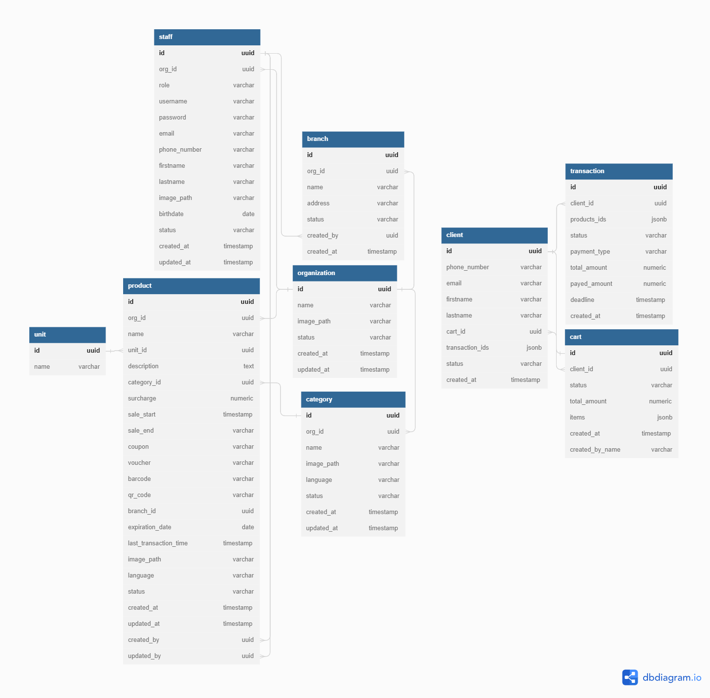

# inventory-api

See the [docker-compose.yml](app/docker-compose.yml) file for more details.

## Tests

To run Unit Tests:

```
sbt test
```

To run Integration Tests we need to run both `PostgreSQL` and `Redis`:


```
docker-compose up
sbt it:test
docker-compose down
```

To run the application using our Docker image, run the following command:

```
docker-compose up -d
sbt run
```

## Architecture
### Project Structure

### Database Structure

### Domain Driven Design (DDD)
Domain driven design is all about developing a _ubiquitous language_, which is a language that you can use to discuss your software with business folks (who presumably do not know programming).

DDD is all about making your code expressive, making sure that how you _talk_ about your software materializes in your code.  One of the best ways to do this is to keep you _domain_ pure.  That is, allow the business concepts and entities to be real things, and keep all the other cruft out.  However, HTTP, JDBC, SQL are not essential to domain, so we want to _decouple_ those as much as possible.

### Onion (or Hexagonal) Architecture
In concert with DDD, the [Onion Architecture](https://jeffreypalermo.com/2008/08/the-onion-architecture-part-3/) and [Hexagonal Architecture from Cockburn](https://java-design-patterns.com/patterns/hexagonal/) give us patterns on how to separate our domain from the ugliness of implementation.

We fit DDD an Onion together via the following mechanisms:

**The domain package**
The domain package constitutes the things inside our domain.  It is deliberately free of the ugliness of JDBC, JSON, HTTP, and the rest.
We use `Services` as coarse-grained interfaces to our domain.  These typically represent real-world use cases. Often times, you see a 1-to-1 mapping of `Services` to `R` or HTTP API calls your application surfaces.

Inside of the **domain**, we see a few concepts:

1. `Service` - the coarse grained use cases that work with other domain concepts to realize your use-cases
1. `Repository` - ways to get data into and out of persistent storage.  **Important: Repositories do not have any business logic in them, they should not know about the context in which they are used, and should not leak details of their implementations into the world**.
1. `payloads` or `models` - things like `Brand`, `Category`, `Item`, etc are all domain objects.  We keep these lean (i.e. free of behavior).

**The repository package**
The repository package is where the ugliness lives.  It has JDBC things, and the like.
it contains implementations of our `Repositories`.  We may have 3 different implementations, an in-memory version, skunk version as well as a **doobie** version.

**The http package**
It contains the HTTP endpoints that we surface via **http4s**.  You will also typically see JSON things in here via **circe**

**The util package**
The util package could be considered infrastructure, as it has nothing to do with the domain.

**NOTE**
All business logic is located in `domain` package, every package inside is related to some domain.

Service classes contains high level logic that relate to data manipulation,
that means that services MUST NOT implement storage.